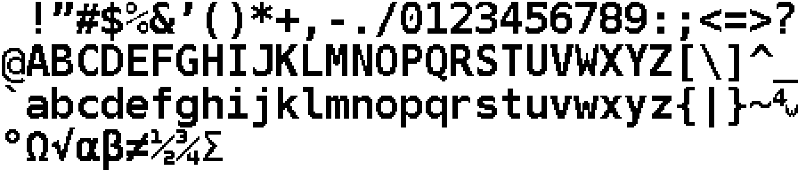

This repository contains a slightly modified version of a bitmap font created
by Illya Tsemenko of [xDevs.com][1].  It includes a Python script used to convert
the .bmp file to a .fnt file for use by [4D Systems][2]'s [Workshop4 IDE][3].

This PNG file shows a preview of the font, including the extra characters
beyond ASCII 0x7E.

[1]: https://xdevs.com/article/lcd-font/
[2]: https://4dsystems.com.au/
[3]: https://4dsystems.com.au/workshop4
